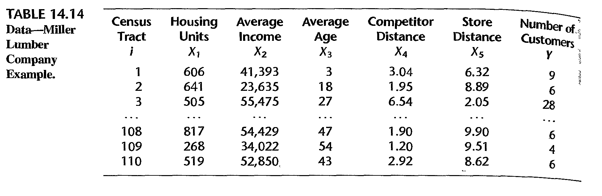
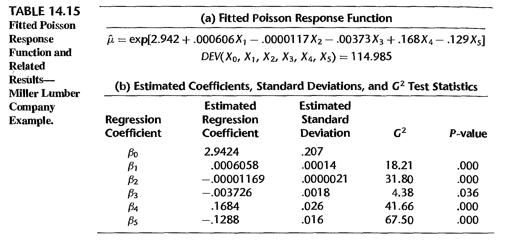
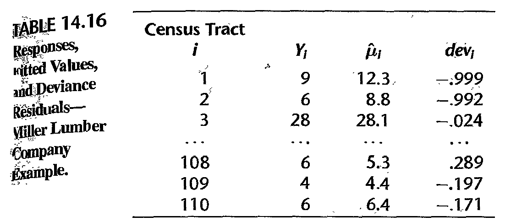
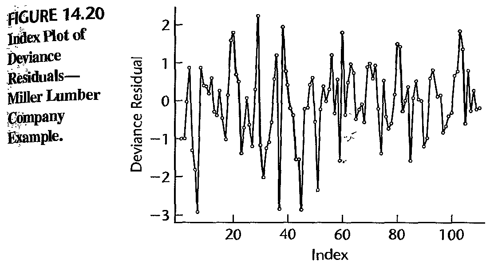

```{r my_opts, cache=FALSE, include=FALSE}
library(knitr)
opts_chunk$set(fig.align="center", fig.height=5, fig.width=5.5, collapse=TRUE, comment="", prompt=TRUE,message=FALSE, warning=FALSE, tidy = FALSE)
options(width=63)
```
#</img>


## Topics to discuss

- Multinomial regression
- Poisson regression


# Multinomial regression

## Observations in classes

Each observations $y_i,i=1,\cdots,n$ belongs to one and only one of $K$ classes:

- Class $1$ obs: $\tilde{y}_{11}$,$\tilde{y}_{12}$,$\cdots$, $\tilde{y}_{1,n_{1}}$
- Class $2$ obs: $\tilde{y}_{21}$,$\tilde{y}_{22}$,$\cdots$, $\tilde{y}_{2,n_{2}}$
- Class ... obs
- Class $K$ obs: $\tilde{y}_{K1}$,$\tilde{y}_{K2}$,$\cdots$, $\tilde{y}_{K,n_{K}}$
 

## Probability mass function

- Model: $P(y_i=k) = p_{ik}$
- Equivalent formulation: set $y_{ij}=1$ if and only if $y_{i}=j$. Then *probability mass function (pmf)*

$$P(y_i=k) = p_{i1}^{y_{i1}}\cdots p_{ik}^{y_{ik}}\cdots
p_{iK}^{y_{iK}}=\prod_{j=1}^{K}p_{ij}^{y_{ij}}$$ 

- Example with $K=3$; comparison with Bernoulli setting

- When $\left\{  y_{i}\right\}  _{i=1}^{n}$ are independent, their joint
likelihood is
\[
L=\prod_{i=1}^{n}p_{i1}^{y_{i1}}\cdots p_{ik}^{y_{ik}}\cdots p_{iK}^{y_{iK}%
}=\prod_{i=1}^{n}\prod_{j=1}^{K}p_{ij}^{y_{ij}}%
\]

## Model

- $Y \in \left\{  1,2,...,K\right\}$ such that
\[
\sum_{k=1}^{K}\Pr\left(  Y=k\right)  =1\text{ and }\prod_{k=1}^{K}\Pr\left(
Y=k\right)  >0
\]
- Model $\Pr\left(  Y=k\right)$ by $X=\left(  X_{1},X_{2},...,X_{p}\right)  ^{T}$
    - Set $p_{k}\left(  X\right)  =\Pr(Y=k|X)$ for $k=1,\ldots,K$ 
    - For $k=1,\ldots,K-1$, set
\begin{equation}
\log\left(  \frac{p_{k}\left(  X\right)  }{p_{K}\left(  X\right)  }\right)
=\beta_{k0}+\beta_{k}^{T}X, 
\end{equation}
where $\beta_{k}=\left(  \beta_{k1},\beta_{k2},...,\beta_{kp}\right)  ^{T}$

## Equivalent model

Model is equivalent to:

\[
p_{k}\left(  x\right) = \Pr(Y=k|X=x)=\frac{\beta_{k0}+\beta_{k}^{T}x}{1+\sum_{l=1}^{K-1}\exp(\beta_{l0}+\beta_{l}^{T}x)}
\]
for $k=1,\ldots,K-1$ and
\[
p_{K}\left(  x\right) =\Pr(Y=K|X=x)=\frac{1}{1+\sum_{l=1}^{K-1}\exp(\beta_{l0}+\beta_{l}^{T}x)}
\]


## Model: sample version

- The modeling strategy
\[
\log\left(  \frac{p_{k}\left(  x_i\right)  }{p_{K}\left(  x_i\right)  }\right)
=\beta_{k0}+\beta_{k}^{T}x_{i}
\]
is equivalent to the formulation provided by `glmnet` as
\[
P\left(  y_{i}=k|X=x_{i}\right)  =\frac{\exp\left(  \tilde{\beta}_{k0}
+\tilde{\beta}_{k}^{T}x_{i}\right)  }{\sum_{l=1}^{K}\exp\left(  \tilde{\beta
}_{l0}+\tilde{\beta}_{l}^{T}x_{i}\right)  }%
\]


## Check on model

- `glmnet` fits model:
\[
P\left(  Y=k|X=x\right)  =\frac{\exp\left(  \beta_{k0}+\beta_{k}^{T}x\right)
}{\sum_{i=1}^{K}\exp\left(  \beta_{k0}+\beta_{k}^{T}x\right)  }\text{ for
}k=1,...,K
\]
- To check the linearity assumption, i.e.,
\[
\log\frac{P\left(  Y=k|X=x\right)  }{P\left(  Y=K|X=x\right)  }=\exp\left(
\beta_{k0}+\beta_{k}^{T}x\right)  \text{ for }k=1,...,K-1
\]
we need the estimated coefficients for each class probability $P\left(Y=k|X=x\right)$

- In general, a goodness-of-fit test for the multinomial logistic regression
model can be the Pearson's chi-square test or the likelihood ratio test

## Check on model

Checking if the multinomial logistic regression assumption is adequate:

- Under suitable conditions, $E\left(  y_{i}-\hat{\mu}_{i}\right)\rightarrow0$ as sample size $n\rightarrow\infty$ when
no regularization that induces bias in $\hat{\mu}_{i}$ is used in model
fitting, where $\hat{\mu}_{i}$ is the estimated mean for $y_{i}$

- When LASSO is used, biased is often induced to $\hat{\mu}_{i}$ as an estimate
of $E\left(  y_{i}\right)$, and in this case we can only have $E\left(y_{i}-\hat{\mu}_{i}\right)\approx 0$ as $n\rightarrow\infty$


# Poisson regression

## Poisson random variable

- A Poisson random variable $Y$ is defined via its *pmf* as
\[
\Pr\left(  Y=k\right)  =\frac{\mu^{k}}{k!}e^{-\mu}\text{ for }k\in\left\{
0,1,2,\ldots\right\}
\]
where $\mu>0$ is fixed. So, $E\left(  Y\right)  =V\left(  Y\right)=\mu$. 

- Given observations $\left(  y_{i},x_{i}\right), i=1,...,n$, set $$p\left(  x_{i}\right)  =E\left(  y_{i}|x_{i}\right)  =\mu_{i}$$
- *Poisson linear regression* model:
\[
\log\left(  p\left(  x_{i}\right)  \right)  =\beta_{0}+\beta_{1}x_{i}
\]

- Above model is equivalent to
$$
\mu_{i}=p\left(  x_{i}\right)  =\exp\left(  \beta_{0}+\beta_{1}x_{i}\right)
$$


## Model assumptions

- Each $y_{i}$ is a Poisson random variable with mean $\mu_{i}$

- $\log\left(  p\left(  x_{i}\right)  \right)$ is a linear function of
$x_{i}$ for $1\leq i\leq n$

- The pairs $\left\{  \left(  x_{i},y_{i}\right)  \right\}_{i=1}^{n}$
are independent

- Joint likelihood function is
$L\left(\beta\right)  =\prod\nolimits_{i=1}^{n}\frac{\mu_{i}^{y_{i}}}{y_{i}!}e^{-\mu_{i}}$
and
$$
\log L\left(  \beta\right)  =\sum_{i=1}^{n}\left[  -\exp\left(  \beta
_{0}+\beta_{1}x_{i}\right)  \right]  + \\
\sum_{i=1}^{n}\left[  y_{i}\left(
\beta_{0}+\beta_{1}x_{i}\right)  -\log\left(  y_{i}!\right)  \right]
$$
with coefficients $\beta=\left(  \beta_{0},\beta_{1}\right)$

## Estimated model

- *Maximum likelihood estimate (MLE)* $\hat{\beta}=\left(  \hat{\beta}_{0}
,\hat{\beta}_{1}\right)$ of $\beta=\left(\beta_{0},\beta_{1}\right)$
satisfies $\hat{\beta}\in\operatorname*{argmin}_{\beta}L\left(  \beta\right)$

- Predictions on $y_{i}$
can be made as
\[
\Pr\left(  y_{i}=k|x_{i}\right)  =\frac{\hat{\mu}_{i}^{k}}{k!}e^{-\hat{\mu
}_{i}}\text{  with }\hat{\mu}_{i}=\exp\left(  \hat{\beta}_{0}+\hat{\beta}
_{1}x_{i}\right)
\]
- Namely, $y_{i}$ is predicted by $\hat{y}_{i}$ for which
\[
\Pr\left(  \hat{y}_{i}=k|x_{i}\right)  =\frac{\hat{\mu}_{i}^{k}}{k!}e^{-\hat{\mu}_{i}}
\]

## Model diagnosis

- *Reduced model*  $\mu_{i}=p\left(  x_{i}\right)  =\exp\left(  \beta_{0}+\beta_{1}x_{i}\right)$ versus *Full model* $E\left(  y_{i}\right)  =\mu_{i}$

- Model deviance is
<!-- \begin{align*} -->
<!-- D  &  =-2\times\left[  \ln L\left(  \text{Reduced model}\right)  -\ln L\left( -->
<!-- \text{Full model}\right)  \right] \\ -->
<!-- &  =-2\left[  \sum_{i=1}^{n}y_{i}\ln\frac{\hat{\mu}_{i}}{y_{i}}+\sum_{i=1}% -->
<!-- ^{n}\left(  y_{i}-\hat{\mu}_{i}\right)  \right]  =\sum_{i=1}^{n}d_{i}^{2}% -->
<!-- \end{align*} -->
$$
D   =-2\times\left[  \ln L\left(  \text{Reduced model}\right)  -\ln L\left(
\text{Full model}\right)  \right] \\
 =-2\left[  \sum_{i=1}^{n}y_{i}\ln\frac{\hat{\mu}_{i}}{y_{i}}+\sum_{i=1}
^{n}\left(  y_{i}-\hat{\mu}_{i}\right)  \right]  =\sum_{i=1}^{n}d_{i}^{2}
$$

## Model diagnosis
- Deviance residual
$$
d_{i}=\operatorname{sgn}\left(  y_{i}-\hat{\mu}_{i}\right)  \sqrt{-2y_{i}
\ln\frac{\hat{\mu}_{i}}{y_{i}}-\left(  y_{i}-\hat{\mu}_{i}\right)  }
$$
- Pearson residual
\[
r_{i}=\frac{y_{i}-\hat{\mu}_{i}}{\sqrt{\hat{\mu}_{i}}}
\]
and Pearson chi-square goodness of fit statistic
\[
\xi^{2}=\sum_{i=1}^{n}\frac{\left(  y_{i}-\hat{\mu}_{i}\right)  ^{2}}{\hat
{\mu}_{i}}=\sum_{i=1}^{n}r_{i}^{2}
\]

## Model diagnosis

- Studentized Pearson residual
\[
\tilde{r}_{i}=\frac{r_{i}}{\sqrt{1-h_{ii}}},
\]
where 
    - $h_{ii}$ is the $i$-th diagonal entry of
\[
H=W^{1/2}X\left(  X^{\prime}WX\right)  ^{-1}X^{\prime}W^{1/2}
\]
    
    - $W$ is the $n\times n$ diagonal matrix with entries $\hat{\mu}_{i}$
    
    - $X$ is the $n\times p$ design matrix


## Model diagnosis

- Poisson model is correct $\implies$ $E\left(  y_{i}-\hat{\mu}_{i}\right)  =0$
asymptotically
- Check linearity assumption: plot $\ln\hat{\mu}_{i}$ against $x_{i}$

- Check Poisson model adequacy: plot $r_{i}$ against $\hat{\mu}_{i}$ 
- Check for influential observations: plot *delta chi-square statistic* 
\[
\Delta\xi_{\left(  i\right)  }^{2}=\xi^{2}-\xi_{\left(  i\right)  }^{2}
\]
and *delta deviance statistic*
\[
\Delta D_{\left(  i\right)  }=D-D_{\left(  i\right)  }
\]
against $i$ (or against $\hat{\mu}_{i}$ or $\hat{\eta}_{i}$)


## Example: data

Miller Lumber Company survey data:

- $X_1$: number of housing units
- $X_2$: average income, in dollars
- $X_3$: average housing unit age, in years
- $X_4$: distance to nearest competitor, in miles
- $X_5$: distance to store, in miles
- $Y$: number of customers who visited store from census tract

(Credit: authors of book "Applied linear statistical models")

## Example: partial data

```{r, echo=FALSE, out.width = '85%'}

```


## Example: fitted model

```{r, echo=FALSE, out.width = '85%'}

```
- $G^2 = - 2 \ln [L(R)/L(R)] \sim$ chi-square distribution


## Example: diagnosis


```{r, echo=FALSE, out.width = '85%'}

```
- deviance residual vs fitted value; table shows no serious issue 

## Example: diagnosis


```{r, echo=FALSE, out.width = '85%'}

```

- a few large negative deviance residuals associated tracts with zero customers; hard to fit these values


## License and session Information

[License](http://math.wsu.edu/faculty/xchen/stat412/LICENSE.html)

<section style="font-size: 0.75em;">
```{r}
sessionInfo()
```
</section>

```{r converttonotes, include=FALSE, cache=FALSE}
source("make_notes.R")
```