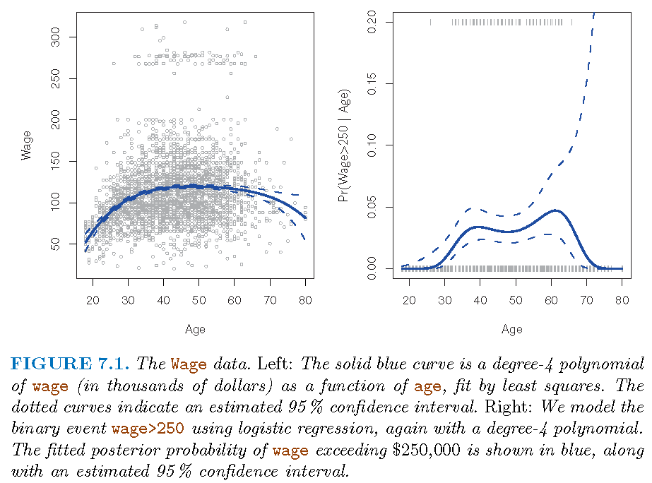
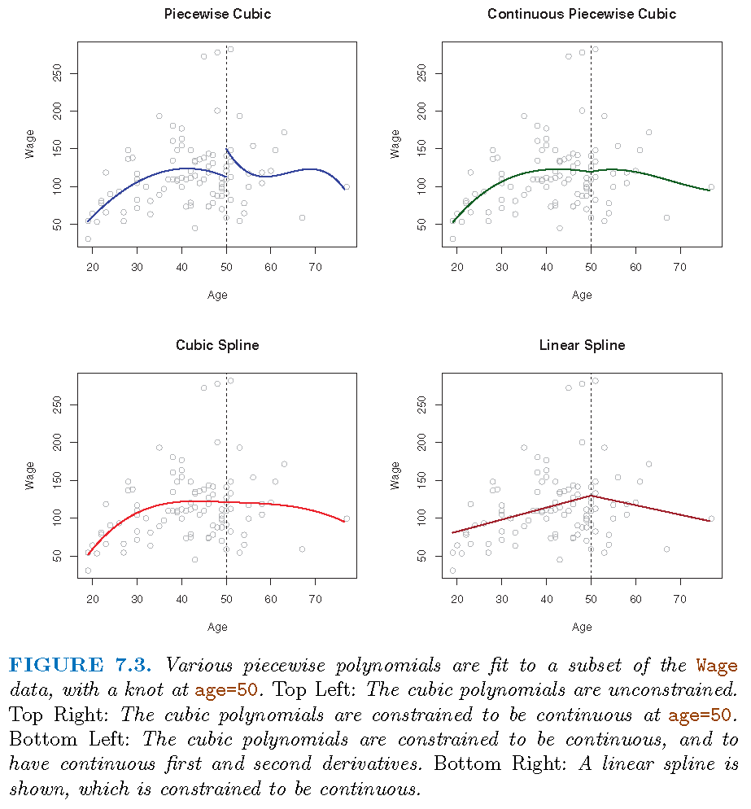
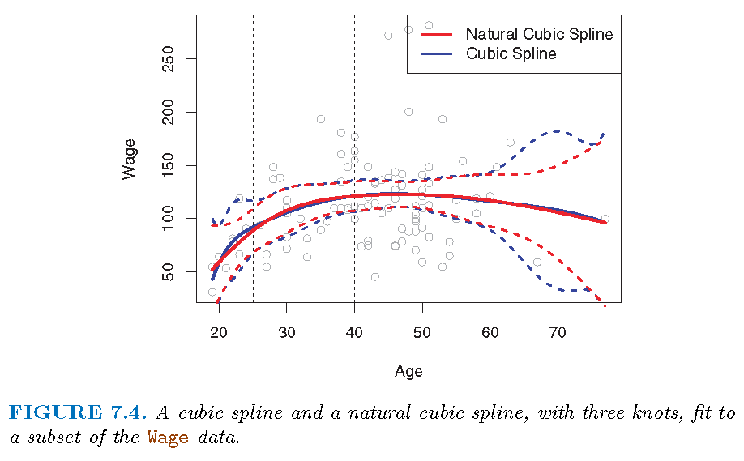
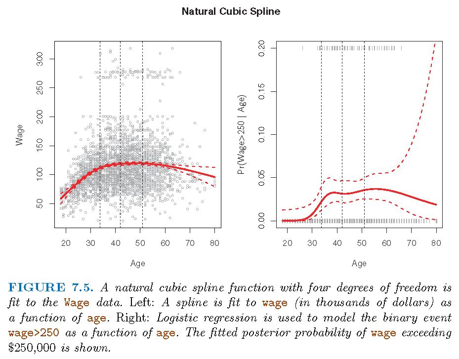
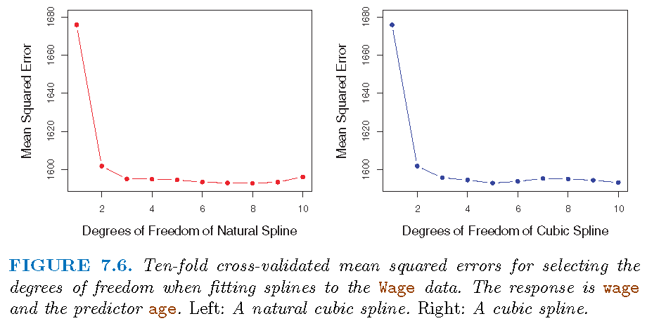
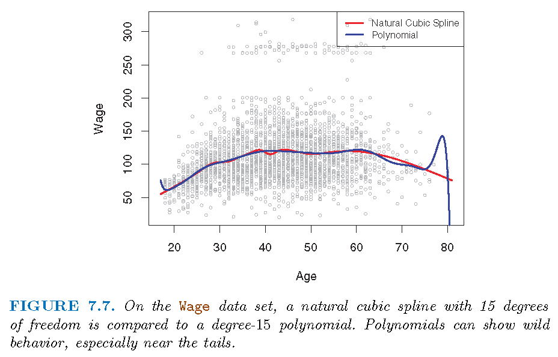
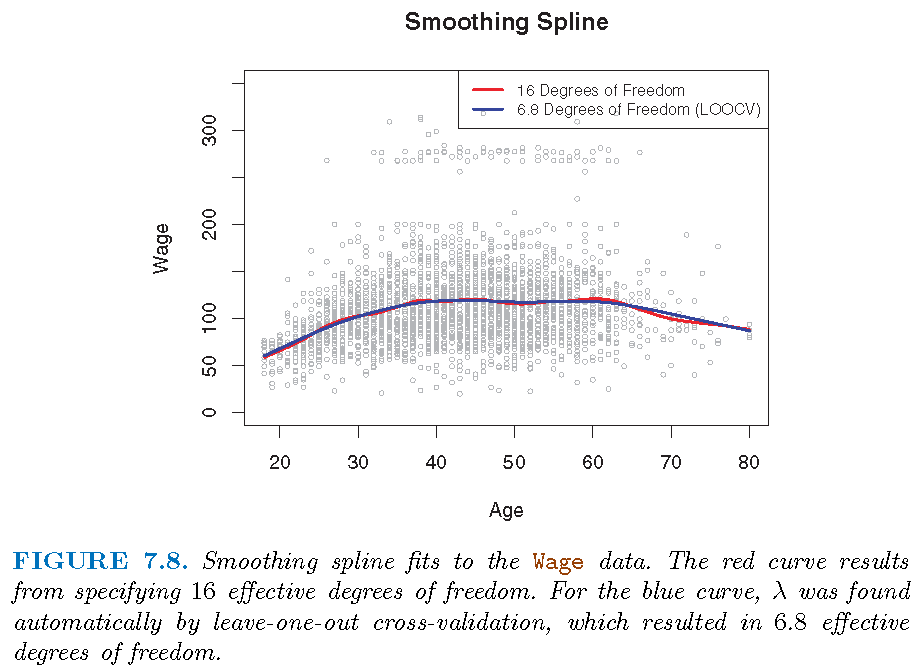
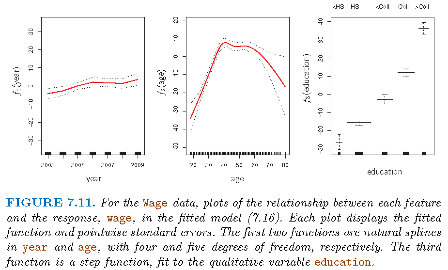
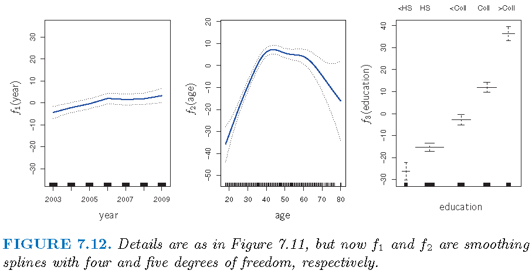
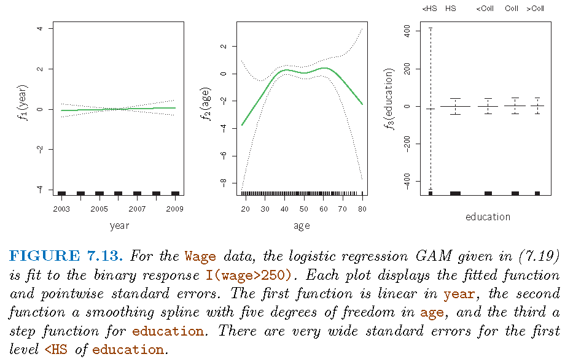

```{r my_opts, cache=FALSE, include=FALSE}
library(knitr)
opts_chunk$set(fig.align="center", fig.height=5, fig.width=5.5, collapse=TRUE, comment="", prompt=TRUE,message=FALSE, warning=FALSE, tidy = FALSE)
options(width=63)
```
#</img>


# Nonlinear regression models


## Overview

- Linear models are simple (e.g., easy to fit and interpret) but quite
inflexible, since often linearity assumption is a poor approximation

- We need to look beyond linear models, and choose
models that somehow are not too complicated but flexible enough to considerably
improve upon linear models

- We will discuss four types of models: *polynomial
regression, spline models*, and *generalized additive models*


# Polynomial regression

## Model

Scalar predictor $X$ and scalar response $Y$:

- Population version:
$$Y=\beta_{0}+\beta_{1}X+\beta_{2}X^{2}+\cdots+\beta_{d}X^{d}+\varepsilon, \mathbb{E}(\varepsilon)=0$$
- Data version:
$$y_{i}=\beta_{0}+\beta_{1}x_{i}+\beta_{2}x_{i}^{2}+\cdots+\beta_{d}x_{i}%
^{d}+\varepsilon_{i}, \mathbb{E}(\varepsilon_i)=0$$
- $\beta_{0},...,\beta_{d}$ can be estimated by the least squares
method, by pretending that $x_{i}^{j}$ for each $j\in\left\{  1,...,d\right\}$ is a predictor when the associated design matrix does not behave badly

## Boundary effect

- Usually $d=3$ or $4$ is set since the polynomial
\[
f\left(  x\right)  =\beta_{0}+\beta_{1}x+\beta_{2}x^{2}+\cdots+\beta_{d}x^{d}
\]
may behave wildly
- Reason: dominant term $\beta_{d}X^{d}$ (when $\beta_{d}\neq0$) varies wildly near boundary of observed $X$ variable

- **Caution**: Boundary effect is a common problem for complicated models, and there are strategies to mitigate this

## Estimated model

- Estimate of $f$:
\[
\hat{f}\left(  x\right)  =\hat{\beta}_{0}+\hat{\beta}_{1}x+\hat{\beta}%
_{2}x^{2}+\cdots+\hat{\beta}_{d}x^{d}
\]
- Covariance matrix of $\hat{\beta}=\left(  \hat{\beta}_{0}
,\hat{\beta}_{1},\hat{\beta}_{2},...,\hat{\beta}_{d}\right)  ^{T}$ as
$\mathbf{C}$

- $\mathbf{C}$ can be complicated


## Confidence band 
- Variance of $\hat{f}\left(x\right)$ for a fixed $x$ is
\begin{align*}
Var\left[  \hat{f}\left(  x\right)  \right]   &  =\underbrace{\left(
1,x,x^{2},...,x^{d}\right)  }_{l_{d}^{T}\left(  x\right)  }\mathbf{C}%
\underbrace{\left(  1,x,x^{2},...,x^{d}\right)  ^{T}}_{l_{d}\left(  x\right)
}\\
&  =l_{d}^{T}\left(  x\right)  \mathbf{C}l_{d}\left(  x\right)
\end{align*}
- Envelope for $\hat{f}\left(  x\right)$ formed by:
\[
\hat{f}\left(  x\right)  \pm 2\sqrt{Var\left[
\hat{f}\left(  x\right)  \right]  }
\]


## Illustration: model

- Model family: 
\[
\Pr\left(  y_{i}>250|x_{i}\right)  =\frac{\exp\left(  \theta_{i}\right)
}{1+\exp\left(  \theta_{i}\right)  }
\]
with
\[
\theta_{i}=\beta_{0}+\beta_{1}x_{i}+\beta_{2}x_{i}^{2}+\cdots+\beta_{d}%
x_{i}^{d}
\]
- $d=1$ gives simple logistic regression

## Illustration: fitted


```{r, echo=FALSE, out.width = '85%'}

```


# Regression splines

## Basis functions

- $\left(d+1\right)$ monomials $1,X,X^{2},...,X^{d}$ generate polynomials $\mathcal{P}_d$ of degree $d$ with elements: 
\[
f_d(x)=\beta_{0}+\beta_{1}x+\beta_{2}x^{2}+\cdots+\beta_{d}x^{d}
\]

-  $d$ **functionally linearly independent** functions $f_{1},...,f_{d}$ generate family $\mathcal{F}$ with elements
\begin{equation}
\tilde{f}\left(  x\right)  =\beta_{0}+\beta_{1}f_{1}\left(  x\right)
+\beta_{2}f_{2}\left(  x\right)  +\cdots+\beta_{d}f_{d}\left(  x\right)
\end{equation}

- $\left\{  f_{i}\right\}  _{i=1}^{d}$ are called \textquotedblleft basis
functions\textquotedblright\ for $\mathcal{F}$

- Note: these are concepts in linear algebra

## Piecewise polynomials

- A *global* polynomial regression model has intrinsic disadvantages

- **Alternative strategy**: fit different polynomial regressions on different parts of data, by requiring these polynomials to be consistent in some sense, so
that the *resultant model displays some stability as it transits from one part
of data to the other*

- Consider the model $M$:
\[
Y=\left\{
\begin{array}
[c]{cc}%
\beta_{01}+\beta_{11}X+\beta_{21}X^{2}+\beta_{31}X^{3}, &  X<c\\
\beta_{02}+\beta_{12}X+\beta_{22}X^{2}+\beta_{32}X^{3}, &  X\geq
c
\end{array}
\right.
\]

## Piecewise polynomials

- Data version
\[
y_{i}=\left\{
\begin{array}
[c]{cc}%
\beta_{01}+\beta_{11}x_{i}+\beta_{21}x_{i}^{2}+\beta_{31}x_{i}^{3}, &  x_{i}<c\\
\beta_{02}+\beta_{12}x_{i}+\beta_{22}x_{i}^{2}+\beta_{32}x_{i}^{3}, &  x_{i}\geq c
\end{array}
\right.
\]

- $M$ has two sub-models, $M_{1}$ and $M_{2}$, on two distinct parts, $D_{1}=\left\{  \left(
X,Y\right)  :X<c\right\}$ and $D_{2}=\left\{  \left(  X,Y\right)  :X\geq
c\right\}$, of data space

- $c$ for $X$ is where $M$ transits from $M_{1}$ to $M_{2}$ (or vice versa); $c$ is
called a "knot"

# Splines: I

## Splines

- Splines are a type of regression polynomials:
    - They employ polynomials up to a fixed degree
    - Where two polynomials meet, some constrains are satisfied
- *Cubic splines* employ $\deg(3)$ polynomials
- *Natural splines* also satisfy linear constraints at boundary
- **Smoothing splines** directly satisfy smoothness constraints and need not to have polynomial components


## Cubic splines

- Two cases of transition of $M$ from $M_{1}$ to $M_{2}$:

    - Case 1: $M_{1}$ does not match $M_{2}$ at $c$; e.g., $M$ jumps from $M_{1}$ to
$M_{2}$ at $c$
    - Case 2: $M_{1}$ matches $M_{2}$ at $c$ in some sense; e.g., $M_{1}$ matches $M_{2}$ at $c$, in value, (and/or) in speed of change, (and/or) in curvature

- For practical purposes it is often desirable to have Case 2, and the
$3$-degree polynomials with matching values (i.e., $M$ itself is continuous),
speeds (i.e., first-order derivatives) and curvatures (i.e., second-order
derivatives) at each knot are called **cubic
splines**

## Illustration


```{r, echo=FALSE, out.width = '80%'}

```


## Smoothing splines

- Split the range of $X$ into $K+1$ parts and only employ polynomials
of degree $d$; so needing $K$ knots and $K+1$ such polynomials

- Restrict these polynomials such that there are $s$ constrains for each distinct pair of
them at a knot, then we have $p=T-C$ parameters to estimate

- $T = (K+1) \times (d+1)$; $(K+1)$ number of distinct regions of
values of $X$, and $d+1$ number of parameters in each polynomial
- $C = K \times s$; $K$ number of knots and $s$ number of
constraints at each knot


## Smoothing splines

In the above formula, $s$, the number of constraints at each knot can be
understood as follows: 

- If submodels $M_{i}$ and $M_{i+1},i=1,...,K$ match
in their values and up to their $\left(  s-1\right)$-th order derivatives at
each knot $Q_{i}$, then at knot $Q_{i}$ there are $s$ constraints on their
associated polynomials

- If we take $0$-th order derivative as performing no
differentiation but keeping original function untouched, then $M_{i}$ and
$M_{i+1},i=1,...,K$ matching up to their $r$-th order derivatives at each knot
$Q_{i}$ induces $r+1$ constraints

## Smoothing splines: representation

- Consider $d=3$. A cubic spline with $K$ knots can be modelled as
\[
y_{i}=\beta_{0}+\beta_{1}b_{1}\left(  x_{i}\right)  +...+\beta_{K+3}b_{K+3}\left(  x_{i}\right)  +\varepsilon_{i}
\]
for an appropriate choice of basis functions $b_{1},b_{2},...,b_{K+3}$ 

- One such basis is partially induced by the function
\[
h\left(  x,\xi\right)  =\left(  x-\xi\right)  _{+}^{3}=\left\{
\begin{array}
[c]{cc}%
\left(  x-\xi\right)  ^{3}, & x>\xi\\
0, & x\leq\xi
\end{array}
\right.
\]

## Smoothing splines: representation

- In summary, to fit a cubic spline to a data set with $K$ knots, we can
equivalently fit the model
\[
Y=\beta_{0}+\beta_{1}X+\beta_{2}X^{2}+\beta_{3}X^{3}+\\
 \beta_{4}%
\underbrace{h\left(  X,\xi_{1}\right)  }_{\text{the 4th predictor}}%
+...+\beta_{K+3}h\left(  X,\xi_{K}\right)  +\varepsilon
\]
or its data version
\[
y_{i}=\beta_{0}+\beta_{1}x_{i}+\beta_{2}x_{i}^{2}+\beta_{3}x_{i}^{3}+\\
\beta_{4}h\left(  x_{i},\xi_{1}\right)  +...+\beta_{K+3}h\left(  x_{i},\xi
_{K}\right)  +\varepsilon_{i}
\]
where $\xi_{1},...,\xi_{K}$ are the knots
- Fitting this model uses $K+4$
degrees of freedom. We can use the least squares method to fit the model


## Natural splines

- As for any regression that employs a polynomial, fitted model may be
unstable near or at the boundary (induced by observed values of
predictors)

- A **natural spline** is a
regression spline which is required to be *linear at the boundary (in the
region where $X$ is smaller than the smallest knot, or larger than the largest knot)*


## Natural/Cubic spline

```{r, echo=FALSE, out.width = '85%'}

```

- Each cubic spline has 3 knots

# Splines: II

## More knots?!

- Regression spline is most flexible in regions that contain a lot of knots, because in those regions the polynomial coefficients can change rapidly. Hence, one option is to place more knots in
places where we feel the function might vary most rapidly, and to place fewer
knots where it seems more stable

- While this option can work well, in practice
it is common to place knots in a uniform fashion. One way to do this is to
specify the desired degrees of freedom, and then have the software
automatically place the corresponding number of knots at uniform quantiles of
the data\textquotedblright, as done, e.g., by *$10$-fold CV based
on the residual sum of squares (RSS) values*


## Placing knots

```{r, echo=FALSE, out.width = '85%'}

```

- $3$ knots, placed at 25th, 50th, 75th percentiles of `age`

## Choosing knots

```{r, echo=FALSE, out.width = '85%'}

```


## Comparison

"Regression splines often give superior results to polynomial regression":

- To be more flexible, polynomial regressions resort to higher
degree polynomials which results in added instability at boundary (of observations for $X$).

- Splines only need to plan for better knots in order to achieve flexibility, and natural splines alleviate instability at boundary

- Spline captures much better (than polynomial regression) local
behavior of $f$ in true model $E(Y|X)=f(X)$ where $f$ changes rapidly.


## Illustration

```{r, echo=FALSE, out.width = '85%'}

```


# Smoothing splines

## Motivation

Smoothing splines are splines produced directly by restricting how
**smooth** a candidate function can be:

- Given the data $\left\{  \left(  x_{i},y_{i}\right)
:i=1,...n\right\}$, there is a function $g$ such that $\sum_{i=1}^{n}\left(  y_{i}-g\left(  x_{i}\right)  \right)^{2}=0$

- In terms of the local properties
of $g$ such as continuity and differentiability, we can restrict the
\textquotedblleft integrated curvature of $g$\textquotedblright, which is
$\int\left[  g^{\prime\prime}\left(  t\right)  \right]  ^{2}dt$.
The integral essentially restricts how variable $g^{\prime\prime}$ is (and
hence approximately how variable the curvature of $g$ is)


## Formulation

- A function $g$ that minimizes
\begin{equation}
\underbrace{\sum_{i=1}^{n}\left(  y_{i}-g\left(  x_{i}\right)  \right)  ^{2}
}_{\text{squared loss}}+\underbrace{\lambda\int\left[  g^{\prime\prime}\left(
t\right)  \right]  ^{2}dt}_{\text{penalty on smoothness}} \label{eq76}%
\end{equation}
(for each fixed $\lambda\geq0$) is called a *smoothing spline*\textquotedblright* 

- When is $g^{\prime\prime}\left(  t\right)$ a constant?
- For practical usage, $\deg\left(  g\right) \ge 3$ if $g$ is a polynomial
- Penalty term referred to as *roughness penalty*

## Key observations


- When $\lambda=0$, the penalty term has no effect and $g$
can be discontinuous and will exactly interpolate the data

- When $\lambda\neq0$, $g$ has to be twice differentiable in order to
possess a second order derivative

- When $\lambda=\infty$, the minimizer $\hat{g}$ must
satisfy $\hat{g}^{\prime\prime}\left(  t\right)  =0$. This means that $\hat
{g}$ has to be a linear function, i.e., $\hat{g}\left(  x\right)  =\beta
_{0}+\beta_{0}x$, in which case we get linear regression


## Complexity and performance

The minimizer $\hat{g}_{\lambda}$ for
$\lambda\in\left(  0,1\right)$, being a shunken version of a natural cubic
spline, has the following properties:

- $\hat{g}_{\lambda}$ is a piecewise cubic polynomial with knots at the
unique values of $x_{1},...,x_{n}$

- $\hat{g}_{\lambda}$ has continuous first and second order derivatives at
each knot

- $\hat{g}_{\lambda}$ is linear in the region outside of the extreme knots


*Proof of the above is a bit complicated and uses machinery from functional
analysis and differential equations*

## Degrees of freedom

- Tuning parameter $\lambda$ controls the *effective
degrees of freedom*, $df_{\lambda}$, of $\hat{g}$

- $df_{\lambda}$ decreases from $n$ to $2$ as $\lambda$ increases from $0$ to
$\infty$

- $df_{\lambda}$ measures flexibility of $\hat
{g}_{\lambda}$, in the sense that larger $df_{\lambda}$ induces a more
flexible $\hat{g}_{\lambda}$

## Degrees of freedom

- Let  $\mathbf{S}_{\lambda}\in\mathbb{R}^{n\times n}$ be formed by evaluating associated basis functions at the $x_{i}$'s. Then
\[
\mathbf{\hat{g}}_{\lambda}=\left(
\begin{array}
[c]{c}%
\hat{g}_{\lambda}\left(  x_{1}\right)  \\
\hat{g}_{\lambda}\left(  x_{2}\right)  \\
\vdots\\
\hat{g}_{\lambda}\left(  x_{n}\right)
\end{array}
\right)  =\mathbf{S}_{\lambda}\left(
\begin{array}
[c]{c}%
y_{1}\\
y_{2}\\
\vdots\\
y_{n}%
\end{array}
\right)
\]

- **Effective degrees of freedom** is defined as
\[
df_{\lambda}=\sum_{i=1}^{n}\mathbf{S}_{\lambda}\left(  i,i\right)  ,
\]
where $\mathbf{S}_{\lambda}\left(  i,j\right)$ is the $\left(  i,j\right)$
entry of $\mathbf{S}_{\lambda}$

## Choose tuning parameter

- Best $\lambda$ achieves the
smallest cross-validation RSS among a grid values of $\lambda$

- Quick computation via *Leave-one-out-cross-validation (LOOCV)* in a single pass
on the whole data:
\[
RSS_{cv}\left(  \lambda\right)  =\sum_{i=1}^{n}\left(  y_{i}-\hat{g}_{\lambda
}^{\left(  -i\right)  }\left(  x_{i}\right)  \right)  ^{2}\\=\sum_{i=1}
^{n}\left[  \frac{y_{i}-\hat{g}_{\lambda}\left(  x_{i}\right)  }
{1-\mathbf{S}_{\lambda}\left(  i,i\right)  }\right]  ^{2}
\]
    - $\hat{g}_{\lambda}^{\left(  -i\right)  }$: fitted on
$\left\{  \left(  x_{j},y_{j}\right)  :j\neq i\right\}$
    - $\hat{g}_{\lambda}$: fitted on $\left\{
\left(  x_{i},y_{i}\right)  :i=1,...,n\right\}$


## Illustration

```{r, echo=FALSE, out.width = '85%'}

```

# Generalized additive models

## Overview

- *Generalized additive models (GAMs)* employs a non-linear function for each
predictor while maintaining additivity of the transformed predictors
- GAMs can
be applied to both quantitative and qualitative responses 

- Consider
\[
y_{i}=\beta_{0}+\beta_{1}x_{i1}+\beta_{2}x_{i2}+\cdots+\beta_{p}%
x_{ip}+\varepsilon_{i}
\]

- Replace $\beta_{j}x_{ij}$ by $f_{j}\left(  x_{ij}\right)$ to get a
GAM as
\[
y_{i}=\beta_{0}+f_{1}\left(  x_{i1}\right)  +f_{2}\left(  x_{i2}\right)
+\cdots+f_{p}\left(  x_{ip}\right)  +\varepsilon_{i}
\]
for a set of known functions $\left\{  f_{j}\right\}  _{j=1}^{p}$

## Illustration: I

- $f_{1}$ and $f_{2}$ natural splines; $f_{3}$ piecewise constant:
\[
\text{wage }=\text{ }\beta_{0}+f_{1}\left(  \text{year}\right)  +f_{2}\left(
\text{age}\right)  +f_{3}\left(  \text{education}\right)  +\varepsilon
\]


```{r, echo=FALSE, out.width = '85%'}

```

## Illustration: II

```{r, echo=FALSE, out.width = '85%'}

```


## GAM logistic Reg

- A binary response, linear version:
\[
\log\left(  \frac{\Pr\left(  Y=1|X\right)  }{1-\Pr\left(  Y=1|X\right)
}\right) \\ =\beta_{0}+\beta_{1}x_{i1}+\beta_{2}x_{i2}+\cdots+\beta_{p}%
x_{ip}+\varepsilon_{i}%
\]

- GAM version:
\[
\log\left(  \frac{\Pr\left(  Y=1|X\right)  }{1-\Pr\left(  Y=1|X\right)
}\right)  \\=\beta_{0}+f_{1}\left(  x_{i1}\right)  +f_{2}\left(  x_{i2}\right)
+\cdots+f_{p}\left(  x_{ip}\right)  +\varepsilon_{i}%
\]

## Illustration: III

- Predict $$p\left(  X\right)  =\Pr\left(  \text{wage}
>250|\text{year,age,education}\right)$$
- Model:
\[
\log\left(  \frac{p\left(  X\right)  }{1-p\left(  X\right)  }\right)
\\ =\beta_{0}+\beta_{1}\times\text{year}+f_{2}\left(  \text{age}\right)
+f_{3}\left(  \text{education}\right)
\]

- Note: there are no individuals
with less than a high school education who earn over \$250,000 per year


## Illustration: III

```{r, echo=FALSE, out.width = '85%'}

```

- GAMs are implemented by R library `gam`

## License and session Information

[License](http://math.wsu.edu/faculty/xchen/stat412/LICENSE.html)

<section style="font-size: 0.75em;">
```{r}
sessionInfo()
```
</section>

```{r converttonotes, include=FALSE, cache=FALSE}
source("make_notes.R")
```